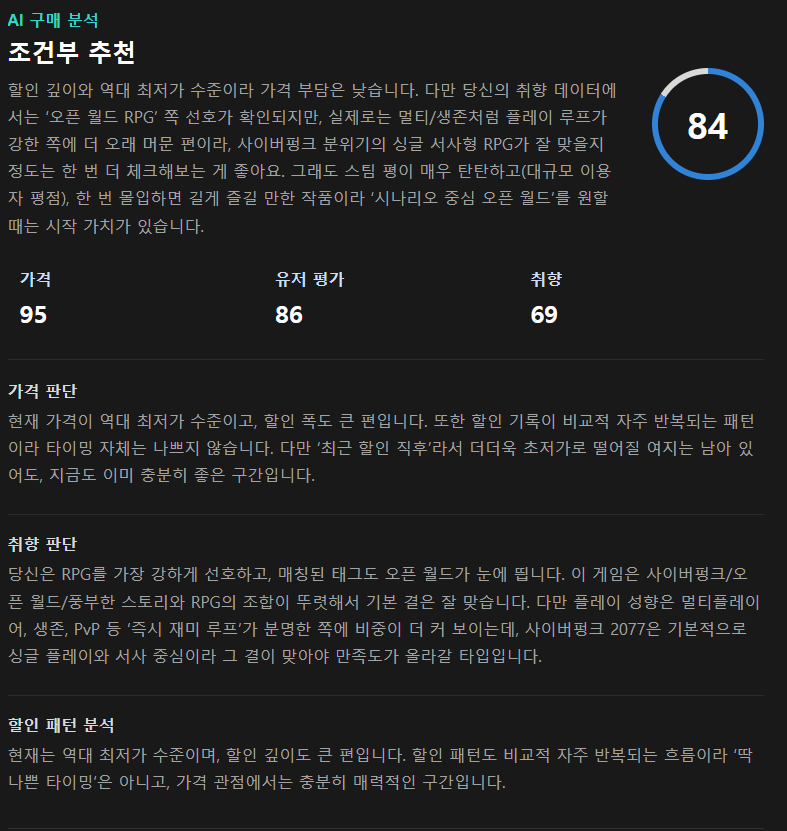
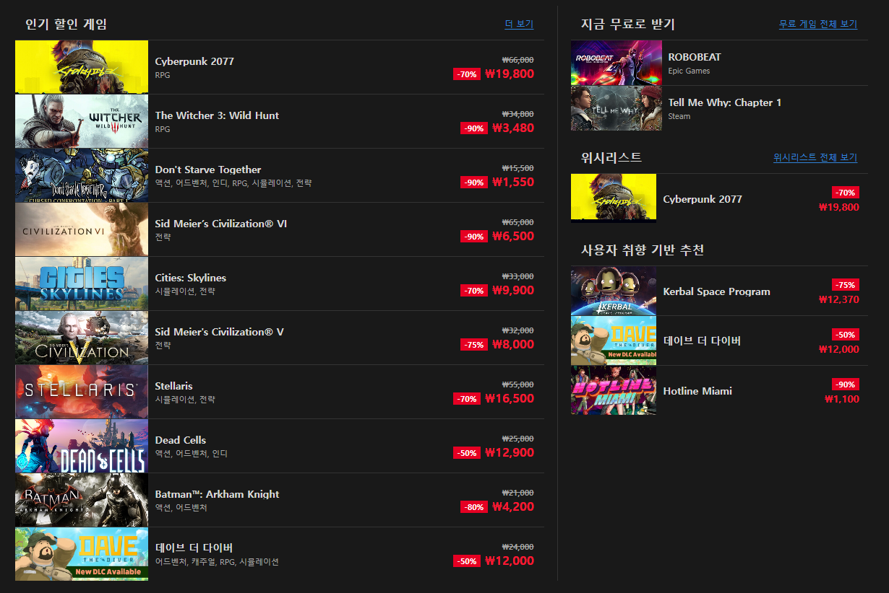
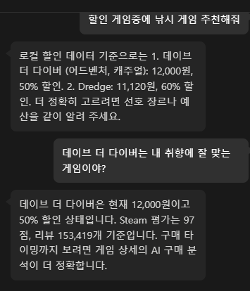

# Critical Deal

게임 구매를 고민하는 사용자를 위한 PC 게임 할인 정보, 가격 추이, 위시리스트, 커뮤니티 댓글, AI 구매 분석 서비스입니다. 사용자는 Steam 중심의 게임 가격과 할인 이력을 확인하고, 자신의 보유 게임과 플레이 시간 기반 취향을 반영한 구매 추천을 받을 수 있습니다.

## 1. 팀원 정보 및 업무 분담

| 이름 | 역할 | 담당 업무 |
| --- | --- | --- |
| 박중현 | 팀장 / Backend | Django REST API 설계, DB 모델링, 외부 API 연동, 가격/할인 데이터 동기화, 인증/이메일 인증, Steam 로그인/보유 게임, AI 구매 분석 및 챗봇 서버 로직, AI 분석 인터랙션, 챗봇 UI, 댓글 UI 설계 |
| 조희주 | 팀원 / Frontend | Vue 3 화면 설계 및 구현, 홈/검색/인기 할인/상세/위시리스트/마이페이지/설정 UI, 다크 테마 디자인, 가격 차트, 반응형 레이아웃 및 사용자 경험 개선, 위시리스트/댓글/대댓글/추천·비추천 Backend 설계 |

## 2. 목표 서비스 및 실제 구현 정도

### 목표 서비스

Critical Deal의 목표는 단순한 게임 검색 서비스가 아니라, “지금 이 게임을 사도 되는지”를 판단하는 데 필요한 정보를 한 화면에서 제공하는 것입니다.

- 게임 검색과 전체 게임 탐색
- Steam 기준 인기 할인 게임, 무료 게임, 추천 게임 노출
- 게임별 현재가, 정가, 할인율, 역대 최저가, 가격 추이 제공
- 위시리스트 기반 관심 게임 관리
- Steam 계정 연동 및 보유 게임/플레이 시간 기반 취향 분석
- AI 구매 분석으로 가격, 평가, 취향을 종합한 구매 판단 제공
- 게임 상세 페이지 댓글, 대댓글, 좋아요/싫어요 기반 커뮤니티 기능
- 챗봇을 통한 게임 추천과 할인 정보 질의응답

### 실제 구현 정도

| 구분 | 구현 상태 | 설명 |
| --- | --- | --- |
| 회원가입/로그인 | 구현 | 이메일 형식 검사, 인증 코드 발송/확인, 로그인, 로그아웃, 세션 유지 |
| Steam 로그인 | 구현 | Steam OpenID 로그인 흐름과 Steam 계정 정보 저장 |
| 프로필/설정 | 구현 | 닉네임 중복 확인, 프로필 이미지 업로드/기본 이미지, 비밀번호 변경, 회원탈퇴 |
| 게임 검색 | 구현 | IsThereAnyDeal 검색 API 및 로컬 DB 검색 결과를 화면에 노출 |
| 전체 게임 목록 | 구현 | 가격, 장르, 평가, DLC 포함 여부, 정렬, 페이지네이션 |
| 홈 화면 | 구현 | 인기 할인, 무료 게임, 위시리스트, 사용자 취향 기반 추천 섹션 |
| 게임 상세 | 구현 | 대표 이미지, 장르/태그/리뷰, 가격 차트, 할인 이벤트, 관련 DLC, 다른 스토어 최저가 |
| 가격 동기화 | 구현 | ITAD/Steam 기반 현재가, 가격 이력, 할인 이벤트, 무료 게임 정보 저장 |
| 위시리스트 | 구현 | 추가/삭제, 목록 페이지, 하트 UI, 홈/상세/목록 연동 |
| 댓글/대댓글 | 구현 | 댓글 작성/수정/삭제, 대댓글, 좋아요/싫어요, 상위 댓글/최신 댓글 페이지네이션, 유저별 댓글 보기 |
| AI 구매 분석 | 구현 | 가격 점수, 유저 평가 점수, 취향 점수, 최종 구매 점수, LLM 설명 및 fallback |
| 챗봇 | 구현 | 게임 추천, 할인/가격 관련 질의응답, 대화형 UI |
| 배포 | 미실시 | 로컬 개발 환경 기준으로 구현 및 테스트 |

## 3. 기술 스택

### Backend

- Python
- Django 5
- Django REST Framework
- django-cors-headers
- python-dotenv
- requests
- dj-database-url
- SQLite 개발 DB

### Frontend

- Vue 3 Composition API
- Vue Router
- Pinia
- Axios
- Chart.js / vue-chartjs
- lucide-vue-next
- Vite

### External APIs

- IsThereAnyDeal API: 게임 검색, 가격, 할인, 가격 이력, 인기 게임 데이터
- Steam Web / Store 데이터: Steam 앱 정보, 태그, 리뷰, 플레이어 수, Steam 로그인
- Resend API: 이메일 인증 코드 발송
- SSAFY GMS OpenAI 호환 API: AI 구매 분석 및 챗봇 응답 생성

## 4. 데이터베이스 모델링 ERD

```mermaid
erDiagram
    AUTH_USER ||--|| USER_PROFILE : has
    AUTH_USER ||--|| USER_STEAM_ACCOUNT : connects
    AUTH_USER ||--o{ USER_GAME : owns
    AUTH_USER ||--o{ USER_WISHLIST : wishes
    AUTH_USER ||--o{ GAME_COMMENT : writes
    AUTH_USER ||--o{ GAME_COMMENT_REACTION : reacts
    AUTH_USER ||--o{ USER_GAME_AI_ANALYSIS : receives
    AUTH_USER ||--o{ EMAIL_VERIFICATION_TOKEN : verifies

    GAME ||--o{ USER_GAME : owned_as
    GAME ||--o{ USER_WISHLIST : wished_as
    GAME ||--o{ PRICE : has
    GAME ||--o{ PRICE_HISTORY : tracks
    GAME ||--o{ DISCOUNT_EVENT : records
    GAME ||--o{ RELATED_PRODUCT : has
    GAME ||--o{ PLAYER_SNAPSHOT : tracks
    GAME ||--o{ GAME_COMMENT : has
    GAME ||--o{ GAME_TAG : tagged_as
    GAME ||--|| GAME_AI_ANALYSIS : caches
    GAME ||--o{ USER_GAME_AI_ANALYSIS : personalized
    GAME ||--o{ RECOMMENDATION : recommended

    STORE ||--o{ PRICE : offers
    STORE ||--o{ PRICE_HISTORY : records
    STORE ||--o{ DISCOUNT_EVENT : records

    GENRE }o--o{ GAME : categorizes
    TAG ||--o{ GAME_TAG : maps
    DEVELOPER }o--o{ GAME : develops
    PUBLISHER }o--o{ GAME : publishes

    GAME_COMMENT ||--o{ GAME_COMMENT : replies
    GAME_COMMENT ||--o{ GAME_COMMENT_REACTION : receives
    RECOMMENDATION ||--|| RECOMMENDATION_ANALYSIS : explains

    AUTH_USER {
        int id PK
        string username
        string email
        string password
    }

    USER_PROFILE {
        int id PK
        int user_id FK
        file avatar
        bool use_default_avatar
    }

    USER_STEAM_ACCOUNT {
        int id PK
        int user_id FK
        string steam_id
        string persona_name
        url avatar_url
        datetime library_synced_at
    }

    USER_GAME {
        int id PK
        int user_id FK
        int game_id FK
        int playtime_minutes
        string source
    }

    GAME {
        int id PK
        string title
        string slug
        string steam_app_id
        string itad_plain
        url thumbnail
        url hero_image
        text short_description
        date release_date
        int popularity_score
        int steam_review_score
        int steam_review_count
    }

    GAME_TAG {
        int id PK
        int game_id FK
        int tag_id FK
        int rank
        int weight
        string source
    }

    PRICE {
        int id PK
        int game_id FK
        int store_id FK
        decimal current_price
        decimal original_price
        int discount_rate
        decimal historical_low_price
        date historical_low_date
    }

    PRICE_HISTORY {
        int id PK
        int game_id FK
        int store_id FK
        decimal price
        int discount_rate
        date recorded_at
    }

    DISCOUNT_EVENT {
        int id PK
        int game_id FK
        int store_id FK
        date started_at
        date ended_at
        int discount_rate
        decimal low_price
    }

    GAME_COMMENT {
        int id PK
        int game_id FK
        int user_id FK
        int parent_id FK
        text content
        datetime created_at
        datetime updated_at
    }

    GAME_COMMENT_REACTION {
        int id PK
        int comment_id FK
        int user_id FK
        int value
    }

    USER_GAME_AI_ANALYSIS {
        int id PK
        int user_id FK
        int game_id FK
        int score
        int price_score
        int taste_score
        int quality_score
        string decision
        text recommendation_text
        json metrics
    }
```



## 5. 핵심 기능

### 5.1 게임 검색 및 탐색

- 상단 검색창에서 게임명을 입력하면 검색 결과 미리보기를 표시합니다.
- 검색 결과에는 썸네일, 제목, 할인율, 현재가, 정가를 표시합니다.
- 검색 페이지에서는 전체 게임 목록을 가격, 장르, Steam 평가, DLC 포함 여부로 필터링할 수 있습니다.
- 정렬 기준은 인기순, 할인율 높은순, 낮은 가격순, 이름순으로 제공합니다.
- 페이지네이션은 현재 페이지 기준 주변 페이지와 처음/끝 페이지를 표시하는 방식으로 구성했습니다.

### 5.2 홈 화면

- 추천 게임 카드를 크게 보여주는 메인 섹션을 구현했습니다.
- 인기 할인 게임, 지금 무료로 받기, 위시리스트, 사용자 취향 기반 추천을 한 화면에서 확인할 수 있습니다.
- 위시리스트와 추천 목록은 홈 화면에서도 가격 UI가 동일하게 보이도록 통일했습니다.

### 5.3 게임 상세 페이지

- 게임 대표 이미지, 제목, 장르, 태그, Steam 리뷰 평가를 표시합니다.
- 위시리스트 버튼은 게임 제목 오른쪽 하트로 제공하며, 클릭 상태에 따라 빈 하트/빨간 하트가 바뀝니다.
- 가격 추이 차트는 정가, 할인가, 역대 최저가를 함께 보여줍니다.
- 최근 할인 이벤트 표를 통해 기간, 할인율, 할인가, 정가를 확인할 수 있습니다.
- 다른 스토어 최저가와 관련 DLC 상품을 확인할 수 있습니다.
- 상세 페이지 진입 중에는 단순 텍스트 대신 스켈레톤 로딩 화면을 표시합니다.

### 5.4 위시리스트

- 게임 상세, 홈, 목록 화면에서 위시리스트 상태를 하트 UI로 표시합니다.
- 위시리스트 페이지에서는 관심 게임을 목록 형태로 보여주고, 하트를 눌러 제거할 수 있습니다.
- 제거 후 새로고침 전까지 목록에 남겨 사용자가 상태 변화를 확인할 수 있도록 처리했습니다.

### 5.5 댓글과 커뮤니티

- 게임 상세 페이지에 댓글 작성, 수정, 삭제 기능을 구현했습니다.
- Steam 로그인 유저의 경우 댓글에 Steam 플레이 시간이 함께 표시됩니다.
- 댓글에 좋아요/싫어요 반응을 남길 수 있습니다.
- 답글은 “답글 n개” 버튼을 눌러 펼쳐보는 구조입니다.
- 댓글 목록은 반응 수가 많은 상위 댓글 3개를 먼저 보여주고, 나머지는 최신순으로 10개씩 페이지네이션합니다.
- 다른 사용자의 프로필/닉네임을 클릭하면 해당 사용자가 작성한 댓글 목록 페이지로 이동합니다.

### 5.6 인증과 계정 관리

- 이메일 회원가입, 이메일 중복 확인, 인증 코드 발송, 인증 코드 확인을 구현했습니다.
- 이메일 발송은 SMTP 대신 Resend HTTPS API 기반으로 변경했습니다.
- 비밀번호는 8자리 이상, 영문/숫자/특수문자 포함 조건을 사용합니다.
- 설정 화면에서 닉네임 변경, 중복 확인, 프로필 사진 업로드, 기본 프로필 적용, 비밀번호 변경, 회원탈퇴를 제공합니다.

### 5.7 챗봇

- 우측 하단 챗봇 버튼을 통해 대화창을 열 수 있습니다.
- 챗봇은 게임 추천, 할인 정보, 가격 추이, 장르 취향 관련 질문에 답변합니다.
- 답변 생성 중에는 실제 채팅 앱처럼 타이핑되는 느낌의 로딩 표시를 제공합니다.
- 챗봇 버튼과 대화 말풍선은 서비스의 다크 UI와 어울리도록 커스텀 스타일을 적용했습니다.

## 6. 추천 알고리즘 기술 설명

추천 기능은 크게 세 종류로 나누어 구현했습니다.

### 6.1 가격 기반 구매 판단

파일: `backend/recommendations/services.py`

`analyze_purchase(game)` 함수는 게임의 현재 가격, 역대 최저가, 할인율, 할인 이력을 바탕으로 구매 점수를 계산합니다.

주요 입력값은 다음과 같습니다.

- 현재 최저가
- 정가
- 할인율
- 역대 최저가
- 현재가가 역대 최저가 대비 어느 정도인지
- 최근 할인 이후 경과 일수
- 평균 할인 간격
- 누적 할인 기록 수

점수 계산 방식은 다음 흐름을 따릅니다.

1. 가격 데이터가 없으면 `NO_PRICE`로 판단하고 기본 점수 50점을 부여합니다.
2. 기본 무료 게임이면 `FREE_TO_PLAY`로 판단하고 가격보다 리뷰/품질 중심으로 점수를 계산합니다.
3. 현재가가 역대 최저가와 같거나 낮으면 높은 가산점을 부여합니다.
4. 역대 최저가보다 조금 비싼 수준이면 중간 가산점을 부여합니다.
5. 할인율은 최대 60%까지 점수에 반영합니다.
6. 할인 주기가 짧은데 현재 할인율이 낮으면 기다리는 쪽으로 감점합니다.
7. 최종 점수에 따라 `BUY`, `CONSIDER`, `WAIT` 중 하나를 결정합니다.

판단 기준은 다음과 같습니다.

| 점수 | 판단 |
| --- | --- |
| 85점 이상 | BUY |
| 60점 이상 | CONSIDER |
| 60점 미만 | WAIT |

### 6.2 사용자 취향 기반 추천

사용자의 보유 게임과 플레이 시간을 기반으로 취향 프로필을 만듭니다.

`build_user_taste_profile(user)`는 다음 정보를 계산합니다.

- 보유 게임 수
- 플레이 시간이 긴 게임
- 플레이 시간 가중치를 반영한 선호 장르
- 플레이 시간과 Steam 태그 가중치를 반영한 선호 태그

`calculate_taste_score(game, profile)`은 추천 대상 게임의 장르/태그와 사용자의 선호 장르/태그가 얼마나 겹치는지 계산합니다.

점수에 반영되는 요소는 다음과 같습니다.

- 장르 일치도
- Steam 태그 일치도
- 가장 강하게 일치한 취향 요소
- 추천 대상 게임의 장르/태그 중 얼마나 많이 매칭되었는지
- 사용자가 보유한 게임 수

홈 화면의 사용자 취향 기반 추천은 다음 가중치를 사용합니다.

| 요소 | 가중치 |
| --- | --- |
| 취향 점수 | 40% |
| Steam 평가 기반 품질 점수 | 10% |
| 할인/가격 매력도 | 50% |

즉, 단순히 할인율이 큰 게임만 추천하지 않고 “사용자가 실제로 좋아할 가능성이 높은 게임”을 우선합니다.

### 6.3 품질 점수

`calculate_quality_score(game)`은 Steam 리뷰 좋아요 비율과 리뷰 수를 기반으로 계산합니다.

- Steam 리뷰 비율이 높을수록 점수가 높습니다.
- 리뷰 수가 1,000개 이상에 가까울수록 신뢰도를 높게 봅니다.
- 리뷰 데이터가 부족하면 기본 50점을 사용합니다.

이를 통해 리뷰 비율은 높지만 리뷰 수가 너무 적은 게임이 과도하게 높게 평가되는 것을 완화했습니다.

## 7. 생성형 AI 활용

### 7.1 서비스 내부 AI 기능

AI 구매 분석은 SSAFY GMS OpenAI 호환 API를 활용합니다.

구현 파일:

- `backend/recommendations/services.py`
- `backend/recommendations/models.py`
- `frontend/src/components/RecommendationScore.vue`
- `frontend/src/pages/GameDetailView.vue`

AI 분석은 무작정 LLM에게 판단을 맡기지 않고, 서버에서 먼저 정량 지표를 계산한 뒤 LLM에게 구조화된 근거를 전달하는 방식으로 구현했습니다.

LLM에 전달되는 주요 정보는 다음과 같습니다.

- 가격 점수
- 취향 점수
- 유저 평가 점수
- 역대 최저가와 현재가 비교
- 최근 할인 주기
- Steam 리뷰 비율과 리뷰 수
- 사용자의 보유 게임/플레이 시간 기반 취향
- 매칭된 장르와 태그

LLM의 역할은 다음과 같습니다.

- 최종 구매 추천 문장 생성
- 가격 판단 이유 설명
- 취향 판단 이유 설명
- 할인 패턴 분석 문장 생성
- `BUY`, `CONSIDER`, `WAIT` 판단을 사람이 읽기 좋은 한국어 문장으로 정리

AI 응답이 실패하거나 API 키가 없을 때는 서버에서 계산한 deterministic fallback 문구를 사용합니다. 또한 AI 결과는 `UserGameAIAnalysis`에 저장하고, 입력 fingerprint와 prompt version을 기준으로 캐시합니다. 같은 조건에서 반복 요청할 때 불필요한 LLM 호출을 줄이기 위한 구조입니다.

### 7.2 챗봇

챗봇은 로컬 DB의 게임/가격/할인 정보를 컨텍스트로 구성한 뒤 GMS Chat Completion API에 전달합니다. 게임명 별칭, 장르 키워드, 태그 키워드를 별도로 처리하여 사용자가 “스타듀밸리 같은 게임”, “공포 협동 게임 추천”처럼 자연어로 말해도 관련 후보를 찾을 수 있게 했습니다.

### 7.3 개발 과정에서의 생성형 AI 활용

개발 과정에서는 생성형 AI를 다음 용도로 활용했습니다.

- UI 레이아웃 초안 비교와 개선 방향 도출
- Django/Vue 코드 수정 과정에서 버그 원인 추적
- 복잡한 CSS 충돌 지점 분석
- README, ERD, 기능 설명 문서 초안 작성 보조
- 구현 후 빌드 오류 원인 파악과 수정 흐름 정리

단, 최종 코드는 프로젝트 구조와 실제 실행 결과를 기준으로 직접 검토하고 수정했습니다.

## 8. 단계별 구현 과정과 회고

### 8.1 기획 단계

처음에는 단순히 게임 할인 정보를 보여주는 서비스로 시작했지만, 기획을 진행하면서 사용자가 실제로 궁금해하는 것은 “할인 중인가?”보다 “지금 사도 후회하지 않을까?”라는 점이라고 판단했습니다. 그래서 가격, 할인 패턴, 사용자 취향, Steam 평가를 함께 고려하는 구매 판단 서비스로 방향을 잡았습니다.

어려웠던 점은 서비스의 범위를 정하는 일이었습니다. 게임 검색, 가격 비교, 위시리스트, AI 분석, 커뮤니티 기능을 모두 넣고 싶었지만 일정 안에서 어떤 기능을 핵심으로 둘지 결정해야 했습니다. 최종적으로 “게임 상세 페이지에서 구매 판단에 필요한 정보를 최대한 모아준다”는 기준을 세우고 기능 우선순위를 정했습니다.

새로 배운 점은 좋은 서비스 기획은 기능의 개수보다 사용자의 판단 흐름을 따라가는 것이 중요하다는 점이었습니다.

### 8.2 데이터 수집 및 외부 API 연동

게임 데이터는 IsThereAnyDeal과 Steam 데이터를 함께 사용했습니다. ITAD에서는 가격, 할인, 검색, 가격 이력을 가져오고, Steam에서는 앱 메타데이터, 태그, 리뷰, 플레이어 관련 정보를 보강했습니다.

어려웠던 점은 외부 API 데이터가 항상 완전하지 않다는 점이었습니다.

- 어떤 게임은 이미지가 없었습니다.
- 어떤 게임은 가격 이력이 부족했습니다.
- 국가 설정에 따라 할인 데이터가 다르게 내려왔습니다.
- DLC와 본편을 구분해야 했습니다.
- Steam 리뷰/태그는 별도 보강 과정이 필요했습니다.

이를 해결하기 위해 DB에 데이터를 캐싱하고, `sync_daily_deals`, `backfill_game_data` 같은 관리 명령어로 데이터를 점진적으로 보강하는 구조를 만들었습니다.

새로 배운 점은 외부 API를 그대로 화면에 뿌리는 것보다, 서비스에 맞는 내부 데이터 모델로 정리하고 캐싱하는 계층이 중요하다는 점입니다.

### 8.3 백엔드 API 구현

Django REST Framework를 사용하여 계정, 게임, 가격, 추천, 위시리스트, 댓글 API를 구성했습니다. URL을 기능 단위로 분리하고, 프론트엔드가 필요한 데이터를 한 번에 받을 수 있도록 상세 API를 구성했습니다.

어려웠던 점은 게임 상세 페이지에서 필요한 데이터가 많다는 점이었습니다. 가격, 가격 이력, 관련 상품, 댓글, 위시리스트 상태, AI 분석을 모두 한 번에 처리하면 응답이 무거워질 수 있었습니다. 그래서 기본 상세 정보와 추가 데이터 요청을 나누고, 화면에서는 보조 데이터 로딩 상태를 별도로 보여주는 방식으로 구성했습니다.

새로 배운 점은 API 설계에서 “한 번에 많이 주는 것”과 “필요할 때 나누어 받는 것” 사이의 균형이 중요하다는 점이었습니다.

### 8.4 인증과 계정 관리

이메일 회원가입, 인증 코드, 로그인, 로그아웃, Steam 로그인, 프로필 수정, 비밀번호 변경, 회원탈퇴를 구현했습니다. 이메일 발송은 SMTP 연결 문제를 겪은 뒤 Resend HTTPS API 기반으로 변경했습니다.

어려웠던 점은 개발 환경의 네트워크 제약이었습니다. SMTP 포트 연결이 막혀 발송이 실패했고, 단순 코드 문제가 아니라 네트워크/메일 제공자 정책 문제임을 확인해야 했습니다. 이후 HTTPS API 기반 메일 발송으로 변경하면서 외부 서비스 연동 방식의 선택도 중요한 설계 요소라는 것을 배웠습니다.

새로 배운 점은 인증 기능은 UI보다 예외 처리가 더 중요하다는 점입니다. 인증 코드 만료, 재발송, 인증 완료 후 버튼 비활성화, 비밀번호 조건 안내처럼 사용자가 막히지 않도록 상태를 세분화해야 했습니다.

### 8.5 추천 알고리즘 구현

추천 알고리즘은 가격 기반 판단에서 시작해 사용자 취향과 Steam 평가를 반영하는 구조로 확장했습니다.

어려웠던 점은 점수를 너무 단순하게 만들면 추천이 설득력을 잃고, 너무 복잡하게 만들면 사용자가 이해하기 어렵다는 점이었습니다. 그래서 최종 점수만 보여주지 않고 가격, 유저 평가, 취향 점수를 분리하여 보여주고, LLM 설명도 함께 제공했습니다.

새로 배운 점은 추천 시스템에서 중요한 것은 점수 자체보다 “왜 추천했는지”를 설명하는 것이라는 점입니다. 그래서 가격 판단 이유, 취향 판단 이유, 할인 패턴 분석을 별도 문장으로 제공했습니다.

### 8.6 프론트엔드 UI 구현

Vue 3 Composition API를 사용하여 홈, 검색, 인기 할인, 상세, 위시리스트, 프로필, 설정, 댓글, 챗봇 화면을 구현했습니다. 전체 UI는 다크 테마를 기준으로 통일하고, 파란색 hover 박스처럼 사용자 경험을 해치는 요소를 줄이며 밑줄, 미세한 밝기 변화, 하트 확대 효과처럼 가벼운 인터랙션을 적용했습니다.

어려웠던 점은 화면마다 비슷한 가격 UI가 조금씩 다르게 보이던 문제였습니다. 홈, 검색 결과, 전체 목록, 위시리스트, 상세 페이지에서 할인율/정가/현재가 정렬을 맞추는 데 많은 시간이 걸렸습니다. 특히 할인 중인 게임과 할인하지 않는 게임의 가격 색상 규칙을 통일하는 과정이 중요했습니다.

새로 배운 점은 UI 완성도는 큰 레이아웃보다 작은 정렬과 상태 표현에서 결정된다는 점입니다. 1~2px의 위치 차이, hover 효과, 스크롤바 색상, 로딩 화면 같은 요소가 전체 인상을 크게 바꿨습니다.

### 8.7 댓글과 커뮤니티 기능

게임 상세 페이지에 댓글, 답글, 추천/비추천, 수정/삭제, 유저별 댓글 보기 기능을 구현했습니다. 댓글은 반응 수 상위 3개를 먼저 보여주고, 나머지는 최신순으로 페이지네이션합니다.

어려웠던 점은 댓글 UI의 밀도였습니다. 닉네임, 작성 시간, Steam 플레이 시간, 댓글 내용, 추천/비추천, 답글, 메뉴 버튼이 모두 들어가야 해서 간격 조절이 중요했습니다. 너무 붙으면 답답하고, 너무 멀면 댓글 흐름이 끊어져 보였습니다.

새로 배운 점은 커뮤니티 UI에서는 기능보다 읽기 흐름이 먼저라는 점입니다. 사용자는 버튼보다 댓글 내용을 먼저 보고 싶어 하므로, 부가 기능은 작고 가볍게 배치해야 했습니다.

### 8.8 AI 기능 구현

AI 구매 분석은 서버에서 정량 데이터를 먼저 계산하고, LLM은 설명을 생성하는 역할로 제한했습니다. 이렇게 하면 LLM 응답이 실패해도 서버 계산값으로 fallback할 수 있고, 사용자에게 일관된 점수를 제공할 수 있습니다.

어려웠던 점은 AI 분석 결과가 너무 느리거나 실패할 때 사용자 경험이 나빠진다는 점이었습니다. 이를 해결하기 위해 분석 중 상태를 단계별로 보여주고, 캐시를 적용했으며, 실패 시 fallback 문구를 제공했습니다.

새로 배운 점은 생성형 AI를 서비스에 넣을 때 “AI가 무엇을 결정하고, 서버가 무엇을 보장할지”를 나누는 것이 중요하다는 점입니다. 모든 판단을 AI에게 맡기기보다, 서버가 계산한 근거를 AI가 설명하도록 만드는 방식이 더 안정적이었습니다.

### 8.9 최종 느낀 점

이번 프로젝트를 통해 단순 CRUD를 넘어 외부 API, 데이터 캐싱, 추천 알고리즘, 생성형 AI, 커뮤니티 기능, UI/UX 개선이 서로 연결되는 과정을 경험했습니다. 특히 백엔드 데이터 구조가 프론트엔드 화면 품질에 직접 영향을 주고, 프론트엔드의 요구사항이 다시 API 설계에 영향을 준다는 점을 많이 느꼈습니다.

가장 크게 배운 점은 “사용자가 보는 작은 불편함은 대부분 구조적인 이유가 있다”는 것입니다. 이미지가 안 보이는 문제는 데이터 소스와 fallback 문제였고, 가격 정렬 문제는 컴포넌트 구조와 CSS 책임 분리 문제였고, AI 분석이 안 되는 문제는 환경변수와 API fallback 문제였습니다. 문제를 화면에서만 보지 않고 데이터, API, 상태, UI를 함께 추적하는 습관이 중요했습니다.

## 9. 실행 방법

### 9.1 Backend

```bash
cd backend
python -m venv .venv
.venv\Scripts\activate
pip install -r ..\requirements.txt
python manage.py migrate
python manage.py runserver 127.0.0.1:8000
```

데이터 동기화와 보강 명령어는 다음과 같습니다.

```bash
python manage.py seed_mock_data
python manage.py sync_daily_deals
python manage.py backfill_game_data --images --reviews --tags
```

댓글 더미 데이터를 생성하려면 다음 명령어를 사용할 수 있습니다.

```bash
python manage.py shell -c "exec(open('scripts/seed_dummy_comments.py', encoding='utf-8').read())"
```

### 9.2 Frontend

```bash
cd frontend
npm install
npm run dev
```

PowerShell에서 `npm` 실행이 막히면 다음처럼 실행합니다.

```bash
npm.cmd install
npm.cmd run dev
```

프론트엔드 개발 서버 기본 주소:

```text
http://127.0.0.1:5173
```

## 10. 주요 API

| 기능 | Method | Endpoint |
| --- | --- | --- |
| 게임 목록 | GET | `/api/games/` |
| 게임 검색 | GET | `/api/games/search/` |
| 장르 목록 | GET | `/api/games/genres/` |
| 게임 상세 | GET | `/api/games/<id>/` |
| 가격 정보 | GET | `/api/games/<id>/prices/` |
| 다른 스토어 가격 | GET | `/api/games/<id>/other-prices/` |
| 관련 상품 | GET | `/api/games/<id>/related-products/` |
| 가격 이력 | GET | `/api/games/<id>/history/` |
| AI 구매 분석 | POST | `/api/games/<id>/ai-analysis/` |
| 댓글 목록/작성 | GET/POST | `/api/games/<id>/comments/` |
| 댓글 수정/삭제 | PATCH/DELETE | `/api/games/<id>/comments/<comment_id>/` |
| 댓글 반응 | POST | `/api/games/<id>/comments/<comment_id>/reaction/` |
| 유저별 댓글 | GET | `/api/games/comments/users/<user_id>/` |
| 이메일 인증 코드 | POST | `/api/accounts/email/code/` |
| 회원가입 | POST | `/api/accounts/signup/` |
| 로그인 | POST | `/api/accounts/login/` |
| 내 정보 | GET | `/api/accounts/me/` |
| 프로필 수정 | PATCH | `/api/accounts/me/profile/` |
| 비밀번호 변경 | POST | `/api/accounts/me/password/` |
| 회원탈퇴 | DELETE | `/api/accounts/me/delete/` |
| 위시리스트 | GET/POST/DELETE | `/api/wishlist/` |

## 11. 배포 URL

현재 배포는 진행하지 않았습니다.

로컬 개발 기준 URL:

- Backend: `http://127.0.0.1:8000`
- Frontend: `http://127.0.0.1:5173`

## 12. 향후 개선 사항

- 실제 운영 DB(PostgreSQL 등) 기준 배포 환경 구성
- Steam 보유 게임 동기화 안정화 및 공개/비공개 라이브러리 예외 처리 강화
- 가격 동기화 스케줄러 운영 자동화
- AI 분석 응답 속도 개선 및 스트리밍 응답 적용
- 추천 알고리즘 A/B 테스트 및 사용자 클릭/구매 관심 로그 반영
- 댓글 신고/차단/운영자 관리 기능 추가
- 모바일 화면 세부 QA 강화

## 13. 제출 요구사항별 코드 캡처 위치

아래 항목은 제출 문서에 캡처하거나 코드 일부를 인용하기 위한 정리입니다. 캡처가 필요한 항목은 파일명과 줄 번호를 함께 적어 두었습니다.

### 13.1 Git 활용


### 13.2 API Key 관리

요구사항 번호: `NF1302`

API Key와 Secret Key는 코드에 직접 작성하지 않고 `.env`에서 읽어오도록 관리했습니다. Django 프로젝트에서는 `python-dotenv` 패키지를 사용하여 루트의 `.env` 파일을 로드하고, `os.getenv()`로 필요한 값을 참조합니다.

코드 인용:

```python
# backend/config/settings.py
from dotenv import load_dotenv

BASE_DIR = Path(__file__).resolve().parent.parent
load_dotenv(BASE_DIR.parent / ".env")

SECRET_KEY = os.getenv("DJANGO_SECRET_KEY") or "dev-only-change-me"
DEBUG = os.getenv("DEBUG", "False").lower() == "true"
```

```python
# backend/external_apis/services.py
@property
def api_key(self):
    return os.getenv("ITAD_API_KEY", "").strip()

def _request(self, method, path, params=None, json=None):
    if not self.api_key:
        raise ItadApiError("ITAD_API_KEY is not configured.")
    params = dict(params or {})
    params["key"] = self.api_key
    response = requests.request(
        method,
        f"{self.base_url}{path}",
        params=params,
        json=json,
        headers={"ITAD-API-Key": self.api_key, "Accept": "application/json"},
        timeout=self.timeout,
    )
```

설명:

- 실제 API Key는 `.env`에만 저장합니다.
- Git에 올라가는 `.env.example`에는 키 이름만 남겨 환경변수 목록을 공유합니다.
- ITAD API 호출 시 key query parameter와 `ITAD-API-Key` header를 사용하지만, 실제 값은 `os.getenv("ITAD_API_KEY")`를 통해 주입됩니다.
- GMS AI Key, Resend API Key도 동일하게 환경변수로 관리합니다.

### 13.3 데이터 확보

외부 API에서 게임, 가격, 할인, 무료 게임 데이터를 가져와 DB에 저장하는 구조를 구현했습니다. 초기 데이터 확보는 `seed_mock_data` 명령어로 수행하고, 이후 최신 할인 정보는 `sync_daily_deals`로 갱신합니다.


코드 인용:

```python
# backend/games/management/commands/seed_mock_data.py
class Command(BaseCommand):
    help = "Seed games and prices from IsThereAnyDeal."

    def handle(self, *args, **options):
        deal_games = sync_itad_deals(options["deals_limit"])
        popular_games = sync_itad_popular(options["popular_limit"])
        pool_games = sync_itad_game_pool(options["pool_limit"]) if options["pool_limit"] else []
        sync_epic_free_games()
        enrich_missing_steam_genres(options["metadata_limit"])
```

```python
# backend/prices/services.py
def sync_daily_deals(deals_limit=200, popular_limit=500, pool_limit=0, include_free_games=True):
    deal_games = sync_itad_deals(deals_limit)
    popular_games = sync_itad_popular(popular_limit) if popular_limit else []
    pool_games = sync_itad_game_pool(pool_limit) if pool_limit else []
    discounted_games = list(
        Game.objects.filter(prices__store__name__iexact="Steam", prices__discount_rate__gt=0)
        .distinct()
        .order_by("-popularity_score", "title")[:500]
    )
    refreshed_discounted_games = sync_prices_for_games(discounted_games)
    free_games = sync_epic_free_games() if include_free_games else []
```

설명:

- IsThereAnyDeal API에서 현재 할인 게임, 인기 게임, 게임 풀 데이터를 가져옵니다.
- Steam 가격이 존재하는 게임만 남겨 실제 서비스에서 사용할 수 있는 데이터 품질을 확보했습니다.
- 가격 이력은 `PriceHistory`에 저장하고, 할인 구간은 `DiscountEvent`로 관리합니다.
- 무료 게임 정보는 별도 모델 `EpicFreeGame`에 저장하여 홈 화면에서 사용할 수 있도록 했습니다.

### 13.4 RESTful 원칙 준수

설명:

- 리소스 중심 URL을 사용했습니다. 예를 들어 게임은 `/api/games/`, 특정 게임은 `/api/games/<id>/`, 특정 게임의 댓글은 `/api/games/<id>/comments/`로 표현했습니다.
- HTTP Method를 의미에 맞게 분리했습니다.
  - `GET`: 목록/상세 조회
  - `POST`: 생성 또는 분석 요청
  - `PATCH`: 일부 수정
  - `DELETE`: 삭제
- 댓글 반응처럼 하위 리소스에 가까운 기능은 `/api/games/<id>/comments/<comment_id>/reaction/`처럼 상위 리소스 관계가 드러나도록 구성했습니다.

대표 URL 예시:

```python
# backend/games/urls.py
path("", GameListView.as_view()),
path("<int:pk>/", GameDetailView.as_view()),
path("<int:pk>/comments/", GameCommentView.as_view()),
path("<int:pk>/comments/<int:comment_pk>/", GameCommentDetailView.as_view()),
path("<int:pk>/comments/<int:comment_pk>/reaction/", GameCommentReactionView.as_view()),
path("<int:pk>/ai-analysis/", GameAIAnalysisView.as_view()),
```

### 13.5 사용자 추천



### 13.6 API 활용



### 13.7 커뮤니티


### 13.8 생성형 AI



## 14. 심화 과제: 생성형 AI 구현 내용

본 프로젝트에서는 생성형 AI를 단순 코드 생성 보조 도구로만 사용하지 않고, 실제 서비스 기능 안에 적용했습니다. 핵심 적용 지점은 게임 상세 페이지의 `AI 구매 분석`과 우측 하단 `AI 챗봇`입니다.

### 14.1 구현 목표

게임 할인 서비스에서 사용자가 가장 궁금해하는 질문은 “이 게임을 지금 사도 되는가?”입니다. 이를 해결하기 위해 가격 데이터, Steam 유저 평가, 사용자의 보유 게임과 플레이 시간 기반 취향을 종합하여 AI가 구매 판단을 설명하도록 구현했습니다.

구현 목표는 다음과 같습니다.

- 현재 가격이 역대 최저가와 얼마나 가까운지 판단
- 최근 할인 주기와 할인 패턴을 분석
- Steam 리뷰 비율과 리뷰 수를 바탕으로 유저 평가 점수 계산
- 사용자의 보유 게임, 플레이 시간, 선호 장르/태그를 바탕으로 취향 점수 계산
- 최종 구매 점수와 `BUY`, `CONSIDER`, `WAIT` 판단 제공
- LLM을 통해 사용자가 이해하기 쉬운 한국어 설명 생성
- API 오류나 Key 미설정 상황에서도 fallback 문구 제공

### 14.2 AI 구매 분석 동작 흐름

AI 구매 분석은 모든 판단을 LLM에 맡기는 방식이 아니라, 서버에서 먼저 정량 점수를 계산하고 LLM은 이를 자연어로 설명하는 방식으로 설계했습니다.

처리 흐름은 다음과 같습니다.

1. 사용자가 게임 상세 페이지에서 `AI 구매 분석` 버튼을 클릭합니다.
2. 프론트엔드는 `/api/games/<id>/ai-analysis/`로 POST 요청을 보냅니다.
3. 백엔드는 게임의 가격 데이터와 할인 이력을 조회합니다.
4. 로그인 사용자의 경우 보유 게임과 Steam 플레이 시간을 기반으로 취향 프로필을 생성합니다.
5. 서버에서 가격 점수, 유저 평가 점수, 취향 점수를 먼저 계산합니다.
6. 계산된 지표와 근거 데이터를 GMS OpenAI 호환 API에 전달합니다.
7. LLM은 구매 추천 문장, 가격 판단 이유, 취향 판단 이유, 할인 패턴 분석을 생성합니다.
8. 결과는 `UserGameAIAnalysis` 모델에 캐싱됩니다.
9. 프론트엔드는 최종 점수 원형 그래프, 세부 점수, AI 분석 문장을 표시합니다.

관련 코드 위치:

- `backend/recommendations/services.py:339-356`
  개인화 구매 점수 계산
- `backend/recommendations/services.py:1037-1141`
  GMS 기반 개인화 LLM 분석 요청 및 fallback 처리
- `backend/recommendations/services.py:1410-1449`
  AI 분석 캐싱 및 재사용
- `backend/recommendations/models.py:50-77`
  사용자별 AI 분석 결과 저장 모델
- `frontend/src/components/RecommendationScore.vue`
  AI 분석 결과 UI 표시
- `frontend/src/pages/GameDetailView.vue`
  AI 분석 요청 및 상세 페이지 연동

### 14.3 AI 구매 분석 코드 핵심

```python
# backend/recommendations/services.py
def get_or_create_personalized_ai_analysis(game, user):
    fingerprint = personalized_fingerprint(game, user)
    minimum_generated_at = timezone.now() - timedelta(days=AI_ANALYSIS_TTL_DAYS)
    cached = (
        UserGameAIAnalysis.objects.filter(
            game=game,
            user=user,
            prompt_version=PERSONALIZED_ANALYSIS_PROMPT_VERSION,
            input_fingerprint=fingerprint,
            generated_at__gte=minimum_generated_at,
        )
        .order_by("-generated_at")
        .first()
    )
    if cached:
        cached_text_source = (cached.metrics or {}).get("text_source")
        if cached_text_source != "fallback":
            return _serialize_personalized_analysis(cached, "cache")

    analysis = calculate_personalized_score(game, user)
    analysis, text, source = _generate_personalized_llm_analysis(game, analysis)
```

위 코드에서는 동일한 사용자와 동일한 게임에 대해 입력 데이터가 변하지 않았다면 기존 AI 분석 결과를 재사용합니다. 이를 위해 가격, 취향, 프롬프트 버전을 반영한 fingerprint를 만들고, 일정 기간 안에 생성된 결과가 있으면 캐시를 반환합니다.

```python
# backend/recommendations/services.py
def _generate_personalized_llm_analysis(game, analysis):
    api_key = os.getenv("GMS_KEY", "").strip()
    if not api_key:
        return analysis, _fallback_personalized_text(game, analysis), "fallback"

    base_url = os.getenv("LLM_BASE_URL", DEFAULT_LLM_BASE_URL).strip().rstrip("/")
    model = os.getenv("LLM_MODEL", DEFAULT_LLM_MODEL).strip()
```

GMS Key가 없을 때는 AI 기능이 중단되지 않도록 fallback 문구를 반환합니다. 덕분에 개발 환경이나 API 장애 상황에서도 사용자는 기본 분석 결과를 확인할 수 있습니다.

### 14.4 챗봇 구현

챗봇은 사용자가 자연어로 게임 추천, 할인 조건, 가격 추이 등을 질문할 수 있도록 만든 기능입니다.

챗봇 구현 특징은 다음과 같습니다.

- 사용자의 질문에서 게임명, 장르, 태그, 할인 조건을 추출합니다.
- 로컬 DB에서 관련 게임 후보와 가격 정보를 먼저 찾습니다.
- 로컬 추천 결과를 fallback 답변으로 구성합니다.
- GMS API Key가 있으면 로컬 컨텍스트를 LLM에 전달하여 자연스러운 답변을 생성합니다.
- GMS 호출 실패, 응답 품질 부족, 금지된 게임명 추천 등이 발생하면 로컬 fallback 답변을 사용합니다.

관련 코드 위치:

- `backend/recommendations/services.py:1615-1698`
  챗봇 응답 생성 흐름
- `backend/recommendations/services.py:2592-2638`
  GMS Chat Completion API 호출
- `frontend/src/layouts/AppLayout.vue` 또는 챗봇 관련 UI 컴포넌트
  챗봇 버튼과 채팅창 표시

코드 핵심:

```python
# backend/recommendations/services.py
def generate_chat_reply(message, user=None, history=None):
    context = _build_chat_context(message, user)
    fallback = _local_chat_reply(message, context)

    api_key = os.getenv("GMS_KEY", "").strip()
    if not api_key:
        return {"reply": fallback, "source": "fallback"}

    reply = _post_gms_chat_completion(
        base_url,
        api_key,
        model,
        messages,
        timeout_seconds=CHAT_LLM_TIMEOUT_SECONDS,
    )
```

### 14.5 프론트엔드 AI UI

프론트엔드에서는 AI 분석이 진행되는 동안 사용자가 기다리는 상황을 이해할 수 있도록 단계별 로딩 UI를 구현했습니다.

구현 내용:

- `AI 분석중 ...` 문구와 점 애니메이션
- 가격, 유저 평가, 취향 항목이 순서대로 분석되는 느낌의 상태 표시
- 분석 완료 후 체크 표시가 점수로 변경
- 최종 구매 점수는 원형 그래프로 표시
- 점수 88점이면 원의 88%가 파란색으로 채워지는 구조
- 상세 설명은 LLM 분석 결과를 그대로 출력하되, 서버에서 sanitizing한 텍스트만 사용

관련 코드 위치:

- `frontend/src/components/RecommendationScore.vue`
- `frontend/src/pages/GameDetailView.vue`
- `frontend/src/assets/styles.css`

### 14.6 생성형 AI를 개발 과정에서 활용한 부분

개발 과정에서도 생성형 AI를 보조적으로 활용했습니다.

- 기능 아이디어 정리
- UI 레이아웃 개선 방향 탐색
- Django/Vue 코드 오류 원인 추적
- 복잡한 CSS 충돌 해결
- README와 ERD 문서 초안 작성
- API 응답 구조와 추천 알고리즘 설명 정리

하지만 최종 결과물은 AI가 생성한 내용을 그대로 사용하지 않고, 직접 실행해 보고 수정했습니다. 특히 AI 구매 분석, 댓글 UI, 위시리스트 UI, 가격 차트처럼 사용자에게 직접 보이는 기능은 실제 화면 확인과 반복 수정 과정을 거쳤습니다.

### 14.7 느낀 점

생성형 AI를 서비스에 적용하면서 가장 중요하다고 느낀 점은 “AI가 모든 것을 판단하게 만드는 것”보다 “AI가 설명을 잘하도록 좋은 근거를 제공하는 것”이었습니다.

가격, 할인율, 할인 주기, 리뷰 비율, 플레이 시간 기반 취향은 서버가 계산하고, AI는 이를 바탕으로 사용자가 이해하기 쉬운 문장으로 바꾸도록 설계했습니다. 이 구조 덕분에 AI 응답이 실패해도 기본 서비스가 유지되고, 응답이 성공하면 더 자연스럽고 설득력 있는 설명을 제공할 수 있었습니다.

또한 AI 기능은 화려한 결과보다 안정성이 중요하다는 점을 배웠습니다. API Key 관리, timeout, fallback, 캐싱, 응답 검증이 함께 있어야 실제 서비스 기능으로 사용할 수 있었습니다.
