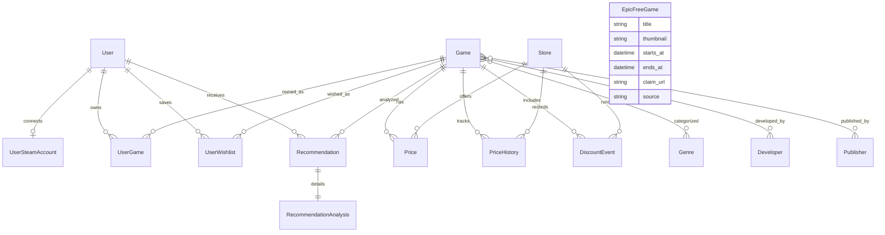

# Critical Deal ERD

## 주요 모델

- `User`: Django 기본 사용자 모델을 사용하며 이메일 로그인은 serializer에서 처리한다.
- `UserSteamAccount`: 사용자의 Steam ID, 프로필 URL, 동기화 상태를 저장한다.
- `Game`: Steam/ITAD 식별자, 이미지, 설명, 장르/개발사/퍼블리셔 관계를 가진다.
- `Price`, `PriceHistory`, `DiscountEvent`: 스토어별 현재가, 가격 히스토리, 할인 이벤트를 분리한다.
- `Recommendation`, `RecommendationAnalysis`: 구매 추천 점수와 근거 지표를 저장할 수 있는 구조다.
- `EpicFreeGame`: Epic 무료 게임 섹션용 데이터를 캐싱한다.

